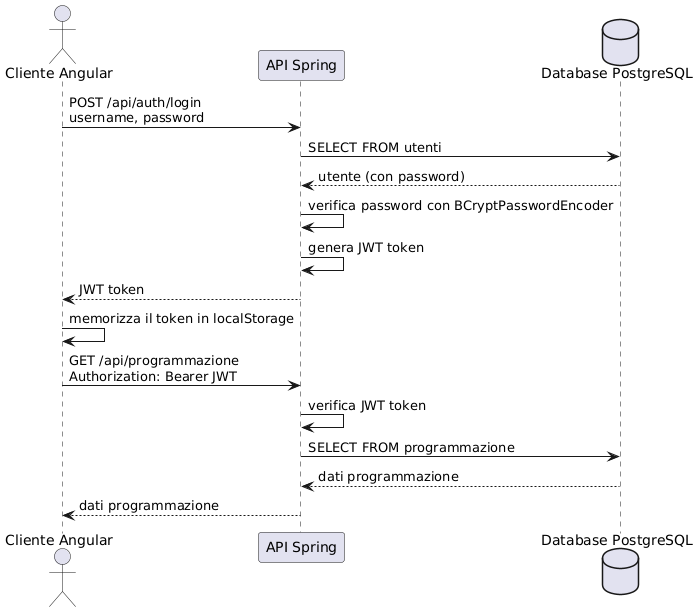
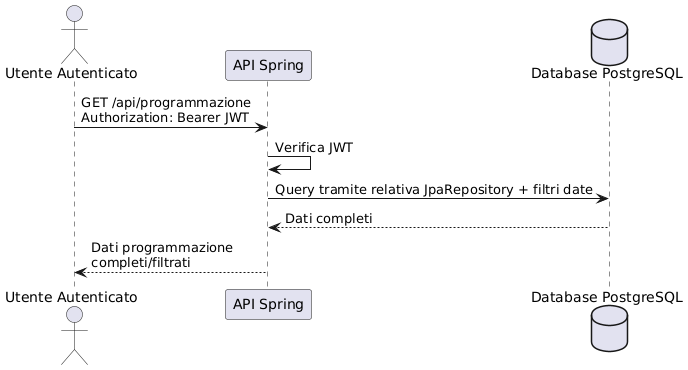
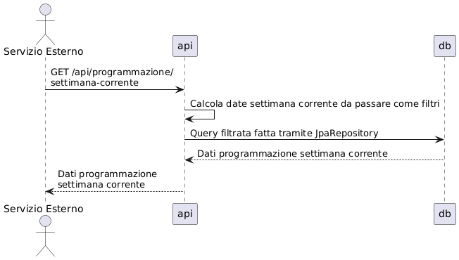

# Architettura del Sistema

### Backend

Il backend è stato strutturato seguendo le indicazioni standard del pattern MVC

#### Package principali

- **Model**: Rappresentano le entità del dominio, mappate direttamente sul DB tramite l'ORM di Hibernate
- **Repository**: Si interfacciano con il Database, estendono JpaRepository in modo da offrire operazioni standard di CRUD già implementate sulle entità
- **Controller**: Gestiscono le richieste HTTP e definiscono gli endpoint dell'API REST
- **Service**: Implementano la logica di business
- **Config**: Configurazioni di base per CSRF, CORS, Middleware per Logging e controllo JWT, Esclusione URL da autenticazione obbligatoria

#### Dipendenze

Definite nel pom.xml del backedn

- Spring Boot Web
- Spring Data JPA
- Spring Security
- JWT
- PostgreSQL

### Frontend (Angular 19)

- Comunicazione con il backend tramite chiamate http all'API Rest
- Gestione dello stato dell'applicazione, principalmente sullo stato di autenticazione dell'utente
- Gestione route guard in base allo stato di autenticazione dell'utente

#### Package Principali

- **Core**: Contiene logica fondamentale, servizi e guard
- - **Servizi**: Gestiscono la logica di business e la comunicazione con il backend
- - **Guard**: Proteggono l'accesso alle funzionalità in base all'autenticazione
- **Shared**: Contiene componenti comuni a molteplici pagine/componenti. In questo caso viene usato per la Navbar
- **Features**: Le funzionalità sono organizzate in features. Ciascuna feature può contenere i componenti delle pagine (Film e Login in questo caso), e un ulteriore cartella con dentro componenti minori che possono essere utilizzati in altre pagine/componenti

#### Dipendenze

- Angular Core e Common
- Angular Material
- RxJS
- Angular Router

## Flusso di Autenticazione

L'autenticazione è gestita in un approccio stateless tramite token JWT (JSON Web Token).

### Processo di Login

1. L'utente invia credenziali (username e password) al backend
2. Il backend verifica le credenziali contro il database
3. Se valide, genera un token JWT firmato con una chiave segreta
4. Il token viene restituito al client
5. Il client memorizza il token nel localStorage
6. Per le richieste successive, il token viene inviato nell'header Authorization

### Verifica del Token

1. Per ogni richiesta autenticata, il client include il token JWT nell'header
2. Il backend cattura e verifica l'autenticità del token con la classe JWTFilter usando la chiave segreta
3. Se valido, estrae l'identità dell'utente e i ruoli
4. La richiesta viene processata in base ai permessi dell'utente e/o endpoint chiamato

### Diagramma di Sequenza di Autenticazione



## Accesso alle API di Programmazione

Il sistema offre due endpoint per accedere ai dati di programmazione:

### 1. Endpoint per utenti autenticati (richiede JWT)

```
GET /api/programmazione
```

Questo endpoint è protetto tramite JWT e permette di visualizzare lo storico completo delle programmazioni, con possibilità di filtraggio per data.




### 2. Endpoint pubblico (non richiede autenticazione)

```
GET /api/programmazione/settimana-corrente
```

Questo endpoint è accessibile pubblicamente e restituisce solo le programmazioni della settimana corrente. È pensato per sistemi di visualizzazione esterni o per utenti non registrati.




