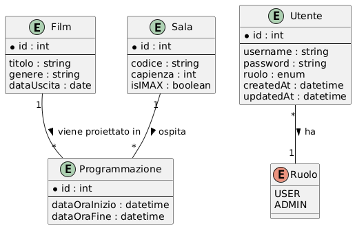
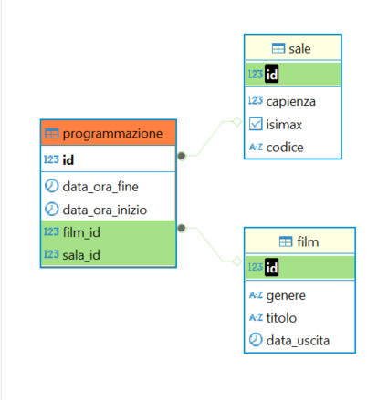

# Modelli e Entità

### Utente

```java
@Table(name = "utenti")
@Entity
public class Utente implements UserDetails {

  @Id
  @GeneratedValue(strategy = GenerationType.AUTO)
  @Column(nullable = false)
  private int id;

  @Column(nullable = false)
  private String username;

  @Column(nullable = false)
  private String password;

  @Enumerated(EnumType.STRING)
  @Column(nullable = false)
  private Ruolo ruolo;

  @CreationTimestamp
  @Column(nullable = false, name = "created_at")
  private Date createdAt;

  @UpdateTimestamp
  @Column(nullable = false, name = "updated_at")
  private Date updatedAt;

  // ...
}
```

### Film


```java
@Entity
public class Film {

  @Id
  @GeneratedValue
  private int id;

  private String titolo;
  private String genere;
  private LocalDate dataUscita;

  // ...
}
```

### Sala

```java
@Entity
@Table(name = "sale")
public class Sala {

  @Id
  @GeneratedValue
  private int id;

  private String codice;
  private int capienza;
  private boolean isIMAX;

  // ...
}
```

### Programmazione

```java
@Entity
@Table(name = "programmazione")
public class Programmazione {

  @Id
  @GeneratedValue
  private int id;

  @ManyToOne
  @JoinColumn(name = "film_id")
  private Film film;

  @ManyToOne
  @JoinColumn(name = "sala_id")
  private Sala sala;

  private LocalDateTime dataOraInizio;
  private LocalDateTime dataOraFine;

  // ...
}
```


## Relazioni tra entità



1. **Film e Programmazione**: uno-a-molti. Un film può avere molte programmazioni, ma ogni programmazione è associata a un solo film.

2. **Sala e Programmazione**: uno-a-molti. Una sala può aver ospitato molte programmazioni, ma ogni programmazione avviene in una sola sala


## Schema del Database
Gli schemi DDL e il diagramma sono stati generati direttamente da DBeaver.

### Tabella film

```sql
CREATE TABLE film (
  id int8 NOT NULL,
  genere varchar(255) NULL,
  titolo varchar(255) NULL,
  data_uscita date NULL,
  CONSTRAINT film_pkey PRIMARY KEY (id)
);
```

### Tabella sale

```sql
CREATE TABLE sale (
  id int4 NOT NULL,
  capienza int4 NOT NULL,
  isimax bool NOT NULL,
  codice varchar(255) NULL,
  CONSTRAINT sale_pkey PRIMARY KEY (id)
);
```

### Tabella utenti

```sql
CREATE TABLE utenti (
  id int8 NOT NULL,
  created_at timestamp(6) NOT NULL,
  "password" varchar(255) NOT NULL,
  ruolo varchar(255) NOT NULL,
  updated_at timestamp(6) NOT NULL,
  username varchar(255) NOT NULL,
  CONSTRAINT utenti_pkey PRIMARY KEY (id),
  CONSTRAINT utenti_ruolo_check CHECK (((ruolo)::text = ANY ((ARRAY['USER'::character varying, 'ADMIN'::character varying])::text[])))
);
```

### Tabella programmazione

```sql
CREATE TABLE programmazione (
  id int4 NOT NULL,
  data_ora_fine timestamp(6) NULL,
  data_ora_inizio timestamp(6) NULL,
  film_id int4 NULL,
  sala_id int4 NULL,
  CONSTRAINT programmazione_pkey PRIMARY KEY (id),
  CONSTRAINT fkpk1y86d0vkqg17yb010huq9pr FOREIGN KEY (sala_id) REFERENCES sale(id),
  CONSTRAINT fkqusqe4h0ylsxia45wxx5rriua FOREIGN KEY (film_id) REFERENCES film(id)
);
```
## Diagramma delle tabelle

